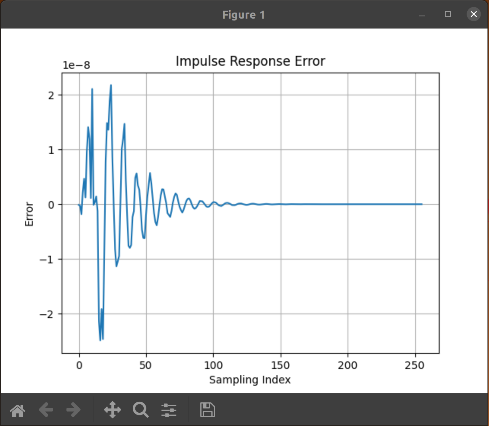
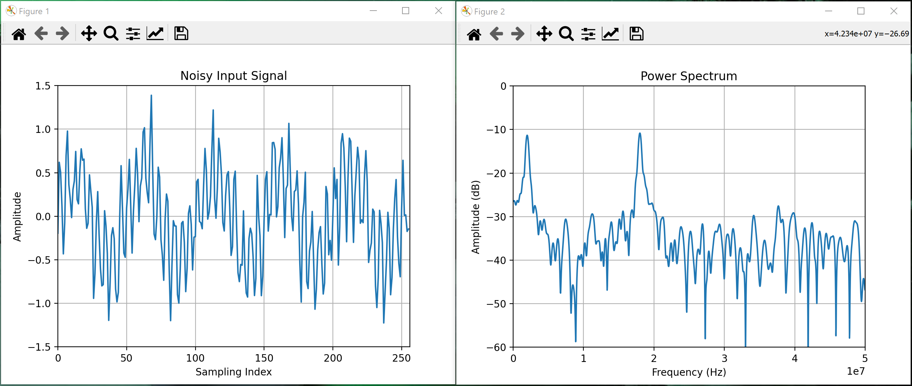
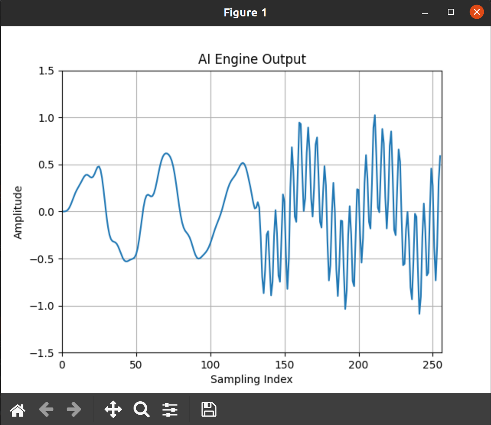

<table class="sphinxhide" width="100%">
 <tr width="100%">
    <td align="center"><h1>AI Engine Development</h1>
    <a href="https://www.xilinx.com/products/design-tools/vitis.html">See Vitis™ Development Environment on xilinx.com</br></a>
    <a href="https://www.xilinx.com/products/design-tools/vitis/vitis-ai.html">See Vitis™ AI Development Environment on xilinx.com</a>
    </td>
 </tr>
</table>

# Implementing an IIR Filter on the AI Engine - Part 1b

***Version: Vitis 2021.2***

## Recap

In Part 1a, we showed the process of calculating 8 outputs of a second order section of an IIR filter *in parallel* using the AI engine.

In this section, we will show how to modify the ADF graph and the testbench for a 6<sup>th</sup> order elliptical lowpass filter.

## Julia Script

`aie_iir_1b.jl` is a [Julia](https://julialang.org/) script which can design and generate the required SIMD coefficients for an arbitrary IIR filter.

In its pristine state, the user parameters are as shown below:

```Julia
first_set = true;	# true: 1st set; false: 2nd set

if first_set
    fp = 10.0e6         	# passband frequency
    coeff_file_suffix = "a"	# file suffix to distinguish different coefficient sets
                        	# with the same architecture
else
    fp = 20.0e6         	# passband frequency
    coeff_file_suffix = "b" 	# 2nd set of coefficients
end # if first_set
    
fs = 100.0e6            # sampling frequency
p = 6                   # no. of poles
rp = 0.1                # passband ripple (dB)
rs = 80.0               # stopband attenuation (dB)
N = 256                 # no. of samples for impulse response
show_plots = true       # display plots?
write_cmatrix = true    # write C matrix to files?
write_impulse = true    # write impulse response?
```

Start Julia and run the script using the following commands:

```
julia> cd("{specify_path_to_aie_iir_1b.jl}")
julia> include("aie_iir_1b.jl")
```

This will plot the filter characteristics and generate three coefficient files (C[1~3]a.h) as there are 6 poles in the filter.


The kernel code will remain the same, but the ADF graph and testbench must be slightly modified to accommodate the additional sections.

Move the generated `*.dat` files into the `data` directory and the generated `*.h` files (coefficient files) into the `src` directory.

## Adaptive Dataflow (ADF) Graph

The modified ADF graph may look something like this:

`graph.hpp`

```C++
#ifndef __GRAPH_H__			// include guard to prevent multiple inclusion

	#define __GRAPH_H__

	#include <adf.h>		// Adaptive DataFlow header

	#include "kernel.hpp"

	using namespace adf;

	// dataflow graph declaration
	class the_graph : public graph {	// inherit all properties of the adaptive     dataflow graph

		private:
			kernel section1;
			kernel section2;
			kernel section3;

		public:
			input_port in;		// input port for data to enter the kernel
			input_port cmtx1;	// input port for SIMD matrix coefficients
			input_port cmtx2;
			input_port cmtx3;
			output_port out;	// output port for data to leave the kernel

			// constructor
			the_graph() {

				// associate the kernel with the function to be executed
				section1 = kernel::create(SecondOrderSection<1>);
				section2 = kernel::create(SecondOrderSection<2>);
				section3 = kernel::create(SecondOrderSection<3>);

				const unsigned num_bytes = 8 * sizeof(float);

				// establish connections
				connect<window<num_bytes>> net0 (in, section1.in[0]);				// window size in bytes
				connect<parameter>(cmtx1, adf::async(section1.in[1]));

				connect<window<num_bytes>> net1 (section1.out[0], section2.in[0]);	// window size in bytes
				connect<parameter>(cmtx2, adf::async(section2.in[1]));

				connect<window<num_bytes>> net2 (section2.out[0], section3.in[0]);	// window size in bytes
				connect<parameter>(cmtx3, adf::async(section3.in[1]));

				connect<window<num_bytes>> net3 (section3.out[0], out);

				// specify which source code file contains the kernel function
				source(section1) = "kernel.cpp";
				source(section2) = "kernel.cpp";
				source(section3) = "kernel.cpp";

				// !!! temporary value: assumes this kernel dominates the AI engine tile !!!
				runtime<ratio>(section1) = 1.0;
				runtime<ratio>(section2) = 1.0;
				runtime<ratio>(section3) = 1.0;

			} // end the_graph()

	}; // end class the_graph

#endif // __GRAPH_H__
```

Notes:

* 2 additional kernels (sections) have been added.
* 2 additional `input_port` declarations for the coefficients of the new sections have been added.
* 2 additional `kernel::create()` statements have been added.
* The [network topology](https://en.wikipedia.org/wiki/Network_topology) has been modified such that the 3 sections are cascaded.
* Additional `source()` and `runtime<ratio>()` statements have been added.

## Testbench Code

The testbench may look something like this:

`tb.cpp`

```C++
//#define RTP_SWITCH		// comment out to check impulse response

#include "kernel.hpp"
#include "graph.hpp"
#include "C1a.h"
#include "C2a.h"
#include "C3a.h"

#ifdef RTP_SWITCH
	#include "C1b.h"
	#include "C2b.h"
	#include "C3b.h"
#endif // RTP_SWITCH

using namespace std;
using namespace adf;

// the testbench requires a virtual platform for simulation
#ifndef RTP_SWITCH
	simulation::platform<1, 1> platform("data/input.dat", "output.dat");
#else
	simulation::platform<1, 1> platform("data/two_freqs.dat", "output.dat");
#endif // RTP_SWITCH


// specify the DFG
the_graph my_graph;

// define connections between virtual platform and the DFG
connect<> net0 (platform.src[0], my_graph.in);
connect<> net1 (my_graph.out, platform.sink[0]);

const unsigned num_pts = 256;						// number of sample points in "input.dat"

#ifndef RTP_SWITCH
	const unsigned num_iterations = num_pts/8;		// number of iterations to run
#else
	const unsigned num_iterations = num_pts/8/2;	// number of iterations to run
#endif // RTP_SWITCH

// main simulation program
int main() {

	my_graph.init();	// load the DFG into the AI engine array, establish connectivity, etc.

	my_graph.update(my_graph.cmtx1, C1a, 96);
	my_graph.update(my_graph.cmtx2, C2a, 96);
	my_graph.update(my_graph.cmtx3, C3a, 96);

	#ifndef RTP_SWITCH
		my_graph.run(num_iterations);	// run the DFG for the specified number of iterations
	#else
		// run with set "a" for 1st half
		my_graph.run(num_iterations);	// run the DFG for the specified number of iterations
		my_graph.wait();	// wait for all iterations to finish before loading new coefficients

		// load set "b"
		my_graph.update(my_graph.cmtx1, C1b, 96);
		my_graph.update(my_graph.cmtx2, C2b, 96);
		my_graph.update(my_graph.cmtx3, C3b, 96);

		my_graph.run(num_iterations);	// run the DFG for the specified number of iterations

	#endif // RTP_SWITCH

	my_graph.end();	// housekeeping

	return (0);

} // end main()
```

Notes:

* With `#define RTP_SWITCH` commented out, only one set of coefficients will be loaded and we can check the impulse response as before.
* An additional set of coefficients is included for the other sections.
* Additional `my_graph.update()` statements are added for the other sections.

## Building and Running the Design

We will use `Emulation-SW` to verify the functionality of the design. Similar to Part1a, we may use Julia to calculate the maximum value of the absolute error between the reference and the generated impulse response (run `check1.jl`). The impulse response error for this 3 stage design is shown below.



## Changing Coefficients During Runtime

We set `first_set` to `false` in `aie_iir_1b.jl` as shown below to generate another set of coefficients for an LPF with a passband of 20MHz.

```Julia
first_set = false;	# true: 1st set; false: 2nd set
...
```

The frequency response with a 20MHz passband is shown below.


Move the generated `*.h` (coefficient files) to `src` and `impresponse_b.dat` to `data`.

We will use `two_freqs.jl` to generate an input signal (`two_freqs.dat`) with two frequencies (f1 = 2MHz, f2 = 18MHz) to test the functionality of coefficient switching. The time and frequency domain plots of the signal are shown below.



Move the generated `two_freqs.dat` to `data`.

In the testbench (`tb.cpp`), we *uncomment* `#define RTP_SWITCH` to include the second set of coefficients.

Note that a `wait()` statement is *required* to allow the specified number of iterations to complete before loading the new set of coefficients.

The output of the AI engines is shown below (use `check2.jl`).



The first half of the plot used coefficients for a 10MHz filter, thus only the noisy 2MHz component passed and the 18MHz component was significantly attenuated.

In the second half, the coefficients are for a 20MHz filter, thus, both 2MHz and 18MHz components are seen at the output.

The complete design is included in the `data` and `src` directories. Refer to the aie_exp/Part1 tutorial if you are unfamiliar with building a Vitis design from scratch.

## Conclusion

We showed how a 6<sup>th</sup> order IIR filter composed of 3 second order sections may be cascaded in the ADF graph.

We also showed how it is possible to change coefficients at runtime using asynchronous run-time parameters.

In Part 1, we have focused only on functional verification using `Emulation-SW`. In upcoming installments, we will analyze the design and optimize it for throughput.

### Support

GitHub issues will be used for tracking requests and bugs. For questions go to [forums.xilinx.com](http://forums.xilinx.com/).

### License

Licensed under the Apache License, Version 2.0 (the "License"); you may not use this file except in compliance with the License.

You may obtain a copy of the License at [http://www.apache.org/licenses/LICENSE-2.0]( http://www.apache.org/licenses/LICENSE-2.0 )


Unless required by applicable law or agreed to in writing, software distributed under the License is distributed on an "AS IS" BASIS, WITHOUT WARRANTIES OR CONDITIONS OF ANY KIND, either express or implied. See the License for the specific language governing permissions and limitations under the License.

<p align="center"><sup>XD108 | &copy; Copyright 2021 Xilinx, Inc.</sup></p>
