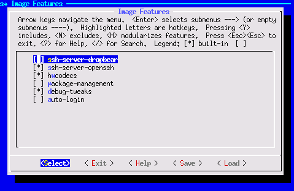
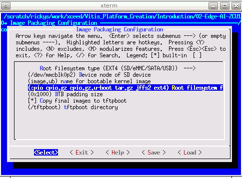

## Step 2: Create the Software Components with PetaLinux

A Vitis platform requires software components. Xilinx provides common software images for quick evaluation. Here since we'd like to demonstrate more software environment customization, we'll use the PetaLinux tools to create the Linux image and sysroot with XRT support, together with some more advanced tweaks. Among all the customizations, the XRT installation and ZOCL device tree setup are mandatory. Other customizations are optional. The customization purposes are explained. Please feel free to pick your desired customization.

Yocto or third-party Linux development tools can also be used as long as they produce the same Linux output products as PetaLinux.

### PetaLinux Project Settings

1. Setup PetaLinux environment: `source <petaLinux_tool_install_dir>/settings.sh`

2. Create a PetaLinux project named ***zcu104_custom_plnx*** and configure the hw with the XSA file we created before:

   ```bash
   petalinux-create --type project --template zynqMP --name zcu104_custom_plnx
   cd zcu104_custom_plnx
   petalinux-config --get-hw-description=<vivado_design_dir>
   ```

   After this step, your directory hierarchy looks like this.

   ```
   - zcu104_custom_platform # Vivado Project Directory
   - zcu104_custom_plnx     # PetaLinux Project Directory
   ```

3. A petalinux-config menu would be launched, select ***DTG Settings->MACHINE_NAME***, modify it to ```zcu104-revc```. Select ***OK -> Exit -> Exit -> Yes*** to close this window.

   ***Note: If you are using a Xilinx development board it is recommended to modify the machine name so that the board configurations would be involved in the DTS auto-generation. If you're using a custom board, you would need to configure the associated settings(e.g. the PHY information DTS node) by yourself manually.***


### Customize Root File System, Kernel, Device Tree and U-boot

1. Add user packages by appending the CONFIG_x lines below to the ***<your_petalinux_project_dir>/project-spec/meta-user/conf/user-rootfsconfig*** file.

   ***Note: This step is not a must but it makes it easier to find and select all required packages in next step. If this step is skipped, please enable the required packages in next step.***

   Packages for base XRT support:

    ```
   CONFIG_packagegroup-petalinux-xrt
   CONFIG_xrt-dev
    ```
    - packagegroup-petalinux-xrt is required for Vitis acceleration flow. It includes XRT and ZOCL.
    - xrt-dev is required in 2020.1 even when we're not creating a development environment due to a known issue that a soft link required by the deployment environment is packaged into it. XRT 2020.2 fixes this issue.

   Packages for easy system management

    ```
   CONFIG_dnf
   CONFIG_e2fsprogs-resize2fs
   CONFIG_parted
    ```
    - dnf is for package package management
    - parted and e2fsprogs-resize2fs can be used for ext4 partition resize

    *Packages for Vitis-AI dependencies support:*

    ```
   CONFIG_packagegroup-petalinux-vitisai
    ```

   *Packages for natively building Vitis AI applications on target board:*

    ```
   CONFIG_packagegroup-petalinux-self-hosted
   CONFIG_cmake
   CONFIG_packagegroup-petalinux-vitisai-dev
   CONFIG_xrt-dev
   CONFIG_opencl-clhpp-dev
   CONFIG_opencl-headers-dev
   CONFIG_packagegroup-petalinux-opencv
   CONFIG_packagegroup-petalinux-opencv-dev
    ```

    *Packages for running Vitis-AI demo applications with GUI*

    ```
    CONFIG_mesa-megadriver
    CONFIG_packagegroup-petalinux-x11
    CONFIG_packagegroup-petalinux-v4lutils
    CONFIG_packagegroup-petalinux-matchbox
    ```

2. Run ```petalinux-config -c rootfs``` and select ***user packages***, select name of rootfs all the libraries listed above.

   

3. *Enable OpenSSH and disable dropbear*
   *Dropbear is the default SSH tool in Vitis Base Embedded Platform. If OpenSSH is used to replace Dropbear, the system could achieve 4x times faster data transmission speed (tested on 1Gbps Ethernet environment). Since Vitis-AI applications may use remote display feature to show machine learning results, using OpenSSH can improve the display experience.*

   a) Still in the RootFS configuration window, go to root directory by select ***Exit*** once.</br>
   b) Go to ***Image Features***.</br>
   c) Disable ***ssh-server-dropbear*** and enable ***ssh-server-openssh*** and click Exit.</br>
   


    d) Go to ***Filesystem Packages-> misc->packagegroup-core-ssh-dropbear*** and disable ***packagegroup-core-ssh-dropbear***. Go to ***Filesystem Packages*** level by Exit twice.

    e) Go to ***console  -> network -> openssh*** and enable ***openssh***, ***openssh-sftp-server***, ***openssh-sshd***, ***openssh-scp***. Go to root level by Exit four times.

4. Enable Package Management

    a) In rootfs config go to ***Image Features*** and enable ***package-management*** and ***debug_tweaks*** option </br>
    b) Set ***package-feed-uris*** to `http://petalinux.xilinx.com/sswreleases/rel-v2020/feeds/zynqmp-generic`. </br>
    c) Click OK, Exit twice and select Yes to save the changes.

5. *Disable CPU IDLE in kernel config.*

   *CPU IDLE would cause CPU IDLE when JTAG is connected. So it is recommended to disable the selection during project development phase. It can be enabled for production to save power.*
   a) Type ```petalinux-config -c kernel```
   b) Ensure the following items are ***TURNED OFF*** by entering 'n' in the [ ] menu selection:

   - ***CPU Power Mangement > CPU Idle > CPU idle PM support***
   - ***CPU Power Management > CPU Frequency scaling > CPU Frequency scaling***
   C) Exit and Save.

6. Update the Device tree.

   Append the following contents to the ***project-spec/meta-user/recipes-bsp/device-tree/files/system-user.dtsi*** file.

   - ***zyxclmm_drm*** node is required by zocl driver, which is a part of Xilinx Runtime for Vitis acceleration flow.
   - ***axi_intc_0*** node overrides interrupt inputs numbers from 0 to 32. Since there was nothing connected to the interrupt controller in the hardware design, it cannot be inferred in advance. 
   - ***sdhci1*** node decreases SD Card speed for better card compatibility on ZCU104 board. This only relates to ZCU104. It's not a part of Vitis acceleration platform requirements.

   ***Note***: an example file is provided in ***ref_files/step2_petalinux/system-user.dtsi***.

   ```
   &amba {
       zyxclmm_drm {
           compatible = "xlnx,zocl";
           status = "okay";
           interrupt-parent = <&axi_intc_0>;
           interrupts = <0  4>, <1  4>, <2  4>, <3  4>,
                    <4  4>, <5  4>, <6  4>, <7  4>,
                    <8  4>, <9  4>, <10 4>, <11 4>,
                    <12 4>, <13 4>, <14 4>, <15 4>,
                    <16 4>, <17 4>, <18 4>, <19 4>,
                    <20 4>, <21 4>, <22 4>, <23 4>,
                    <24 4>, <25 4>, <26 4>, <27 4>,
                    <28 4>, <29 4>, <30 4>, <31 4>;
       };
   };
   
   &axi_intc_0 {
         xlnx,kind-of-intr = <0x0>;
         xlnx,num-intr-inputs = <0x20>;
         interrupt-parent = <&gic>;
         interrupts = <0 89 4>;
   };
   
   &sdhci1 {
         no-1-8-v;
         disable-wp;
   };
   
   ```


7. Add EXT4 rootfs support

   Since Vitis-AI software stack is not included in PetaLinux yet, they need to be installed after PetaLinux generates rootfs. PetaLinux uses initramfs format for rootfs by default, it can't retain the rootfs changes in run time. To make the root file system retain changes, we'll use EXT4 format for rootfs in second partition while keep the first partition FAT32 to store boot.bin file.

   Run `petalinux-config`, go to ***Image Packaging Configuration***, select ***Root File System Type*** as ***EXT4***, and append `ext4` to ***Root File System Formats***. Exit and Save.

   

   Update ***bootargs*** to allow Linux to boot from EXT4 partition. There are various ways to update bootargs. Please take either way below.
   
   - Run `petalinux-config`
   - Change ***DTG settings -> Kernel Bootargs -> generate boot args automatically*** to NO and update ***User Set Kernel Bootargs*** to `earlycon console=ttyPS0,115200 clk_ignore_unused root=/dev/mmcblk0p2 rw rootwait cma=512M`. Click OK, Exit thrice and Save.
   
   - Update in  ***system-user.dtsi***: add `chosen` node in root in addition to the previous changes to this file.
   ```
   /include/ "system-conf.dtsi"
   / {
	   chosen {
	   	bootargs = "earlycon console=ttyPS0,115200 clk_ignore_unused root=/dev/mmcblk0p2 rw rootwait cma=512M";
	   };
   };
   ```

   Please note in the bootargs, we also set these options:
   - ***clk_ignore_unused***: it tells Linux kernel don't turn off clocks if this clock is not used. It's useful clocks that only drives PL kernels because PL kernels are not represented in device tree.
   - ***cma=512M***: CMA is used to exchange data between PS and PL kernel. The size for CMA is determined by PL kernel requirements. Vitis-AI/DPU needs at least 512MB CMA.

### Build Image and Prepare for Platform Packaging

1. We would store all the necessary files for Vitis platform creation flow. Here we name it ```zcu104_custom_pkg ```. Then we create a pfm folder inside. 

   ```
   mkdir zcu104_custom_pkg
   cd zcu104_custom_pkg
   mkdir pfm
   ```

   After this step, your directory hierarchy looks like this.

   ```
   - zcu104_custom_platform # Vivado Project Directory
   - zcu104_custom_plnx     # PetaLinux Project Directory
   - zcu104_custom_pkg      # Platform Packaging Directory
     - pfm                  # Platform Packaging Sources
   ```

2. From any directory within the PetaLinux project, build the PetaLinux project.

   ```
   petalinux-build
   ```

3. Create a sysroot self-installer for the target Linux system

   ```
   petalinux-build --sdk
   ```

4. Install sysroot: type ```./images/linux/sdk.sh``` to install PetaLinux SDK, use the `-d` option to provide a full pathname to the output directory ***zcu104_custom_pkg/pfm*** (This is an example ) and confirm.

   - Note: The environment variable ***LD_LIBRARY_PATH*** must not be set when running this command

We would install Vitis AI library and DNNDK into this rootfs during test phase.

***Note: Now HW platform and SW platform are all generated. Next we would [package the Vitis Platform](step3.md).***

### Fast Track

Scripts are provided to re-create PetaLinux project and generate outputs. To use these scripts, please run the following steps.

1. Run build

   ```
   # cd to the step directory, e.g.
   cd step2_petalinux
   make all
   ```

2. To clean the generated files, please run

   ```bash
   make clean
   ```

<p align="center"><sup>Copyright&copy; 2020 Xilinx</sup></p>
